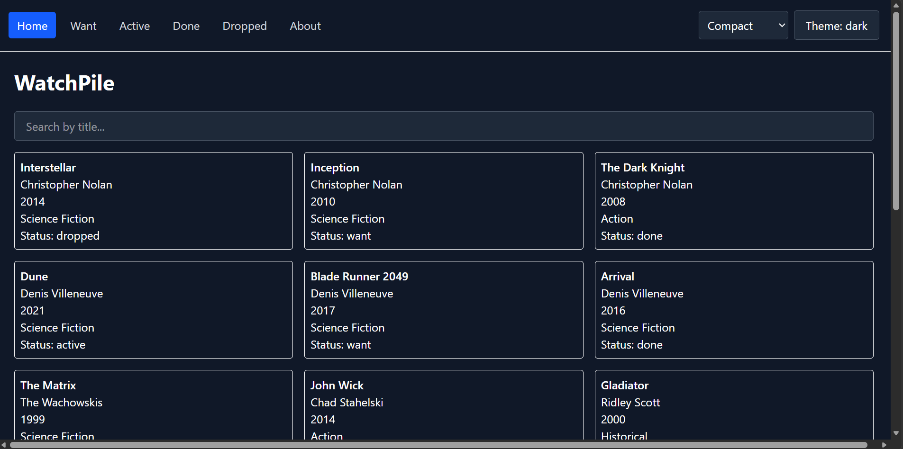
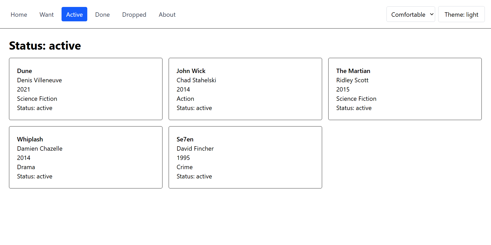
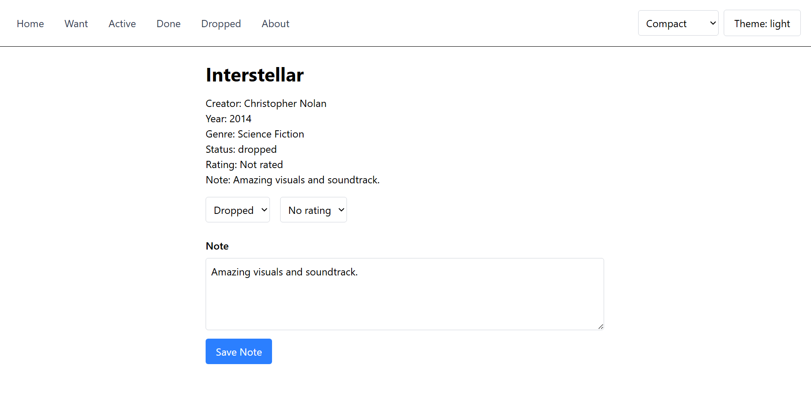

# WatchPile

A personal movie tracking app built with React + TypeScript. Browse a catalog of films, track your watch status, leave notes, and rate movies you've finished.

## Theme

A movie tracker where you can organize films into four lists, Want, Active, Done, and Dropped, with ratings and personal notes on each.

## Screenshots

### Catalog Page



### Status Filter



### Movie Detail




## Setup

Two terminals are required:

**Terminal 1: API server:**
```bash
npm install
npm run server
```

**Terminal 2: Vite dev server:**
```bash
npm run dev
```

Open [http://localhost:5173](http://localhost:5173) in your browser.

To reset the database to its original seed data:
```bash
npm run reset-db
```

## Tech Stack

- React 19 + TypeScript
- React Router v7
- TanStack Query v5
- Zustand v5 with persist middleware
- Tailwind CSS v4
- json-server v0.17.4

## Features

- Browse full movie catalog with title search (query persists in URL)
- Filter by status: Want, Active, Done, Dropped
- Detail page per movie: update status, rating, and notes
- Light/dark theme toggle persisted across reloads
- Compact/comfortable density toggle persisted across reloads
- Responsive layout for mobile and desktop

## Project Structure

```text
assignment-4/
├── screenshots/
│   ├── Catalpg.png
│   ├── Detail.png
│   └── Status.png
│
├── src/
│   ├── components/
│   │   ├── DensitySelector.tsx
│   │   ├── NavBar.tsx
│   │   ├── SearchBar.tsx
│   │   └── ThemeToggle.tsx
│   │
│   ├── pages/
│   │   ├── AboutPage.tsx
│   │   ├── CatalogPage.tsx
│   │   ├── DetailPage.tsx
│   │   ├── NotFoundPage.tsx
│   │   └── StatusPage.tsx
│   │
│   ├── services/
│   │   └── api.ts
│   │
│   ├── store/
│   │   └── useUiStore.ts
│   │
│   ├── types/
│   │   └── Item.ts
│   │
│   ├── App.tsx
│   ├── main.tsx
│   └── index.css
│
├── db.json
├── db.seed.json
├── package.json
├── README.md
└── vite.config.ts
```